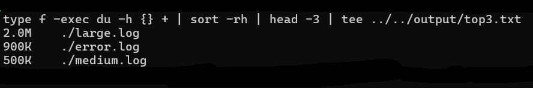
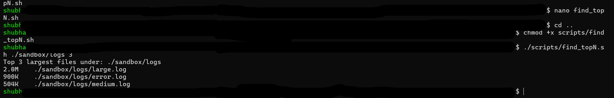
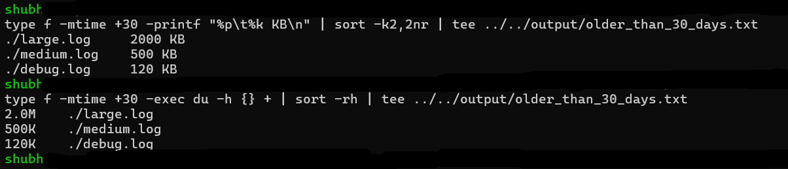
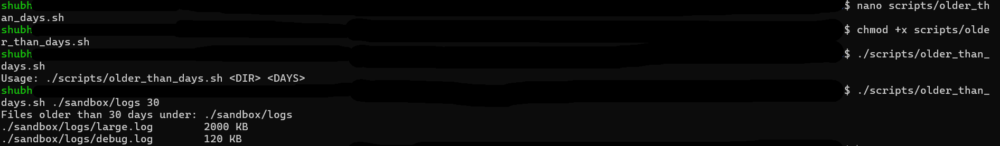

# Day 01 — Files & Logs (One-Liners Only)

## What I practiced today
- Find top-N largest files using: `find → du → sort → head`
- List files older than X days with sizes using `find -printf`
- Observed the difference between `mtime`, `ctime`, and `atime` using `stat`
- Wrote scripts and understood each and every line how it is done and also mentioned easch and every line in the scripts. 

---

## Commands I ran

# Top 3 largest files
```
find . -type f -exec du -h {} + | sort -rh | head -3
```




# Script:



# Older than 30 days with sizes (fast)
```
find . -type f -mtime +30 -printf "%p\t%k KB\n" | sort -k2,2nr
find . -type f -mtime +30 -exec du -h {} + | sort -rh
```




# Script:



---

# Time fields demo on medium.log
stat medium.log
chmod 640 medium.log
stat medium.log
echo "x" >> medium.log
stat medium.log


---

# My takeaways (quick notes)
- mtime = content changed, ctime = inode/metadata changed, atime = last accessed.
- Prefer find -printf or du over parsing ls.
- For big trees, ncdu is a great visual alternative to du + sort.
