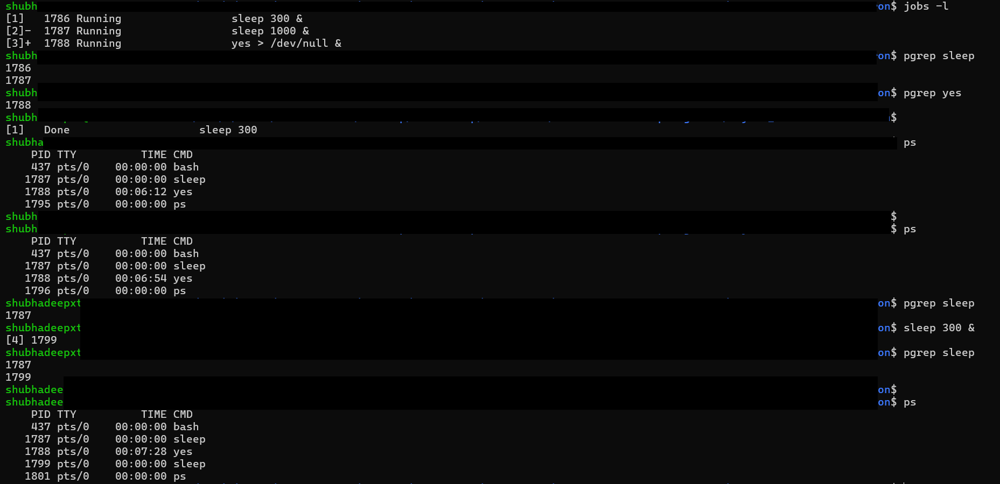
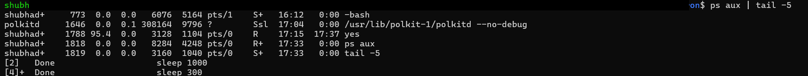

# Day 02 — Processes & Cron

## 📖 What I Practiced
- Process management basics: `ps`, `top`, `pgrep`, `kill`
- Difference between `ps aux` (BSD style) and `ps -ef` (SysV style)
- Using `grep '[s]leep'` trick vs `pgrep` for cleaner PID search
- Viewing CPU/memory usage with `ps aux --sort`
- Monitoring processes with `top` and `top -H -p <PID>` (threads view)
- Sending signals with `kill`, difference between SIGTERM (15) and SIGKILL (9)
- Checking system uptime and interpreting load averages

## 📸 Screenshots

- Starting dummy processes 
  

- ps output (short vs aux vs -ef) 
   
  
  
  
  

- grep vs pgrep 
  

- top full view 
  

- top threads view for one PID 
  

- Killing processes (SIGTERM vs SIGKILL) 
  

- uptime and load averages 
  

## 💡 Key Takeaways
- `ps aux` is better for resource usage, `ps -ef` is better for parent-child tracing
- Always use `pgrep` in scripts (machine-friendly), `ps | grep` for quick checks
- `kill` = SIGTERM (15, graceful), `kill -9` = SIGKILL (force, last resort)
- Load average must be compared to number of CPU cores (`nproc`)
- Memory usage is better understood with `free -h` or `top`

---
📌 Next: convert this learning into a **process monitor script** and schedule with **cron** (Day-2 Part B).

