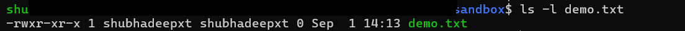
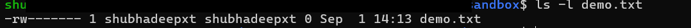

### Section 1 — User Identity Commands

**Practiced Commands:**
- `whoami` → confirms the current effective user
- `id` → shows UID, GID, and group memberships
- `groups` → quick check of group memberships
- `getent passwd <user>` → fetch user info from system DB (local + LDAP)

**DevOps Use Cases:**
- Debugging permission errors in CI/CD or containers
- Verifying service accounts/groups (e.g., Jenkins, Docker, Nginx)
- Confirming which user a script actually runs as when using `sudo`/`su`

**Screenshots:**
- 
- 
- 
- 

---

### Section 2 — User Management

**Practiced Commands:**
- `useradd -m <user>` → create user with home directory
- `passwd <user>` → set password
- `usermod -aG <group> <user>` → add user to group
- `userdel -r <user>` → delete user and home

**DevOps Use Cases:**
- Create service accounts for Jenkins, Nginx, Prometheus (security best practice)
- Add accounts to groups like `sudo` or `docker`
- Remove stale accounts for compliance/security

**Screenshots:**
*(Optional, since on WSL these may not all work; safe to just show syntax in README)*

---

### Section 3 — File Permissions

**Practiced Commands:**
- `ls -l file` → shows permissions in rwx format
- `chmod 755 script.sh` → owner full, group/others execute only
- `chmod 644 config.txt` → common for config files
- `chmod 600 secret.key` → secure private keys

**DevOps Use Cases:**
- Scripts need `+x` to run
- Configs (nginx.conf, .env files) are usually 644
- Secrets like SSH keys must be 600 (SSH refuses looser perms)
- Sticky bit on /tmp ensures users can’t delete each other’s files
- Private keys (`id_rsa`) must be `600` or SSH will refuse them

**Screenshots:**
### Screenshots
- 
- 
- 
- 

---

### Section 4 — Ownership

**Practiced Commands**
- `chown user file` → change file owner
- `chown user:group file` → change owner & group
- `chown -R user:group dir/` → recursive ownership
- `chgrp group file` → change only group

**DevOps Use Cases**
- Set `/var/www/html` owned by `www-data` for Nginx
- Ensure Jenkins workspace owned by `jenkins` user
- Adjust group ownership (e.g., `docker`) for CI/CD pipelines

**Key Point**
- `chmod` controls *what permissions* are set
- `chown/chgrp` controls *who owns* the file

---

### Section 5 — SSH Basics

**Practiced Commands**
- `ssh-keygen -t rsa -b 4096 -C "you@example.com"` → generate key pair
- `ssh-copy-id user@host` → copy public key to server
- `ssh user@host` → login using key
- `~/.ssh/config` → simplify connections

**DevOps Use Cases**
- Key-based auth for GitHub/GitLab repos
- Jenkins/Ansible use keys to connect to nodes
- More secure than passwords; automation-friendly

**Screenshots (planned)**
- 
- 

