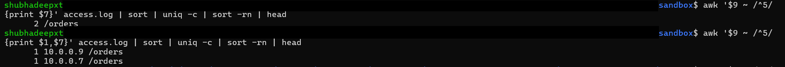
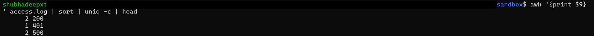
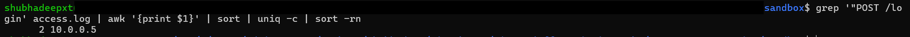
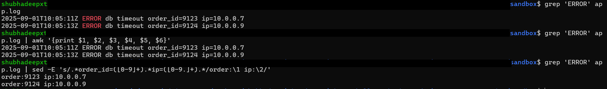
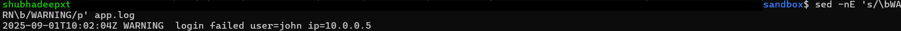

# Day 04 — Text Parsing & Log Triage

This lab covers practical usage of **grep**, **awk**, and **sed** for log analysis and triage.  
We worked with dummy `access.log` (web server log) and `app.log` (application log) files.

---

## Section 1 — Find Top Endpoints with 5xx Errors
```
awk '$9 ~ /^5/ {print $7}' access.log | sort | uniq -c | sort -rn | head
```

- $9 → status code (200, 401, 500…)
- $7 → request path (/login, /orders, …)
- Useful to find which endpoints are failing most.

- 

---

## Section 2 — Status Code Distribution
```
awk '{print $9}' access.log | sort | uniq -c | sort -rn
```

- Shows counts of 200, 401, 500, etc.
- Helps visualize error spikes and success ratio.

- 

___

## Section 3 — IPs Hitting /login
```
grep '"POST /login' access.log | awk '{print $1}' | sort | uniq -c | sort -rn
```

- $1 → client IP
- Helps detect brute-force login attempts.

- 

---

## Section 4 — Extract Details from app.log
```
grep 'ERROR' app.log | sed -E 's/.*order_id=([0-9]+).*ip=([0-9.]+).*/order:\1 ip:\2/'
```

- Extracts order_id and client IP from error lines.
- Provides clean structured view for debugging.

- 

---

## Section 5 — Bulk Edit with sed
```
sed -E 's/\bWARN\b/WARNING/g' app.log > ../output/app_warn_fix.log

diff -u app.log ../output/app_warn_fix.log | head
```

- Safely replaces WARN with WARNING.
- Redirect output instead of editing logs in place.

- 

---

