# Day 05 — Networking & System Info

---

## Section 1 — Hostname & Networking Basics

### Practiced Commands
```
- hostname
- uname -a
- ip addr
- ping -c 4 google.com
```

### What these commands are

- hostname → shows or sets the system hostname.
- uname → short for Unix Name, prints system/kernel information.
- ip → modern tool for network configuration (replacement for ifconfig).
- ping → tests ICMP reachability to another host.


### DevOps Use Cases

- hostname → confirm which node/pod you’re on during on-call or SSH hops.
- uname -a → kernel/OS details; spot cgroups/kernel feature mismatches.
- ip addr → interfaces & IPs; debug cluster/VPC subnet issues.
- ping → quick connectivity test to external/internal endpoints.


### Screenshots

- 
- 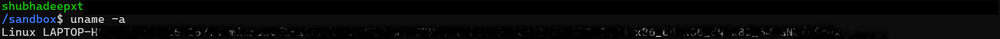
- 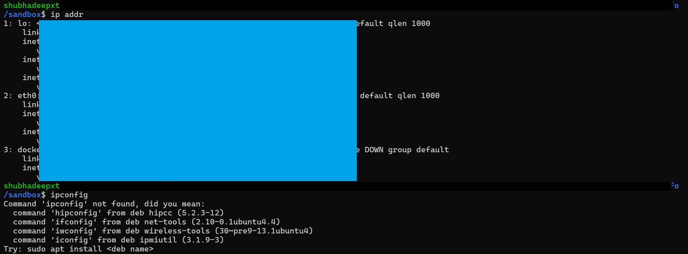
- 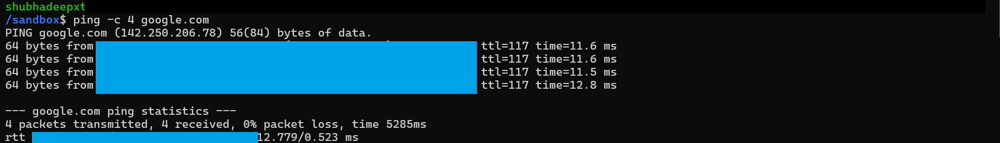

---

## Section 2 — Ports & Connections

### Practiced Commands
```
ss -tuln
ss -tn state established | head
sudo lsof -i :8000
curl -I http://127.0.0.1:8000/
```

### What these commands are

- ss → short for Socket Statistics, shows listening sockets & connections.
- lsof → short for List Open Files, shows which processes own which files/ports.
- curl → short for Client URL, transfers data from/to servers (common for HTTP APIs).

### DevOps Use Cases

- ss -tuln → check which ports are listening.
- ss -tn state established → monitor active TCP sessions.
- lsof -i :PORT → find which process owns a port.
- curl -I → quick HTTP health check.


### Screenshots

- 
- 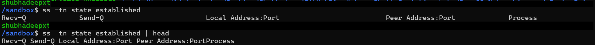
- 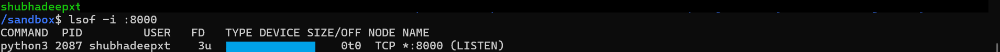
- 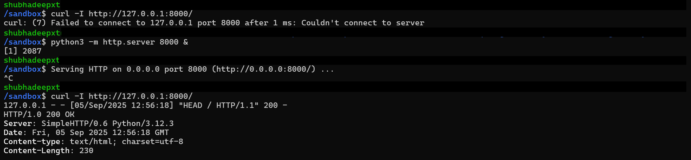
- 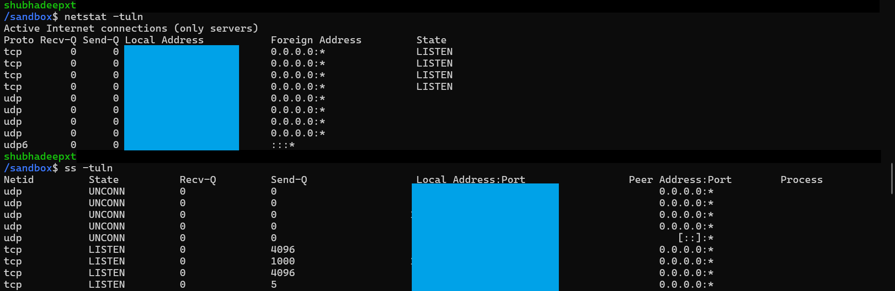

---

## Section 3 — DNS & Routing

### Practiced Commands
```
nslookup google.com
dig +short google.com
traceroute goole.com
```


### What these commands are

- nslookup → short for Name Server Lookup, queries DNS to resolve domain → IP.
- dig → short for Domain Information Groper, advanced DNS query tool.
- traceroute → shows the path packets take (hops) to reach a destination.


### DevOps Use Cases

- nslookup → quick way to check if DNS resolution works.
- dig +short → clean, script-friendly IP resolution of a domain.
- traceroute → detect network delays or hops causing issues between clusters or regions


### Screenshots

- 
- 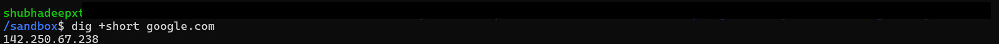
- 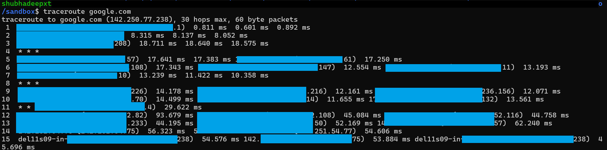

---

## Section 4 — System Info & Monitoring

### Practiced Commands
```
uptime
free -m
df -h
top
```

### What these commands are

- uptime → system run time + load average.
- free → memory usage snapshot.
- df → disk usage per filesystem.
- top → interactive process/memory monitor.


### DevOps Use Cases

- uptime → see load vs CPU cores, detect reboot time.
- free -m → check memory usage/leaks.
- df -h → find disk pressure in CI/CD or DB hosts.
- top → identify runaway processes in real time.


### Screenshots

- 
- 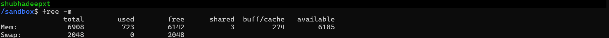
- 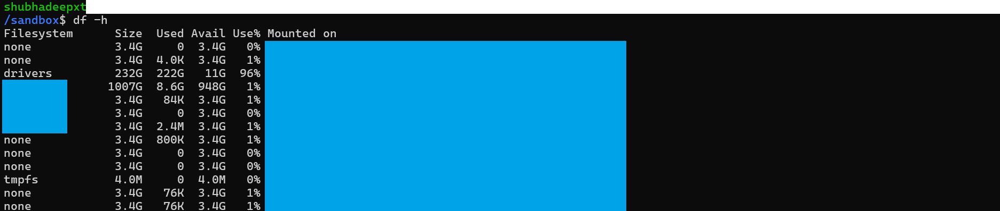

---

## Section 5 — Hands-on Drill & Script

### Script: check_port.sh
Checks if a given port is listening on the system.

```
#!/usr/bin/env bash
./scripts/check_port.sh <port>
```


### Usage Examples

- With a running server on port 8080 → [OK] Port 8080 is listening
- After stopping the server → [FAIL] Port 8080 is not listening


### Screenshots

- 
- 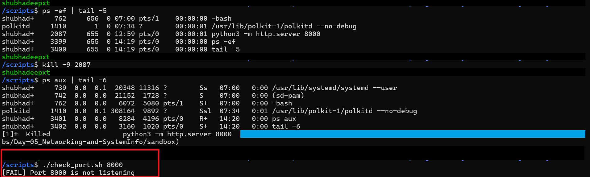

